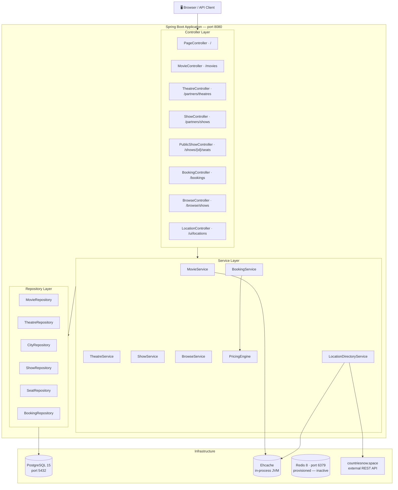
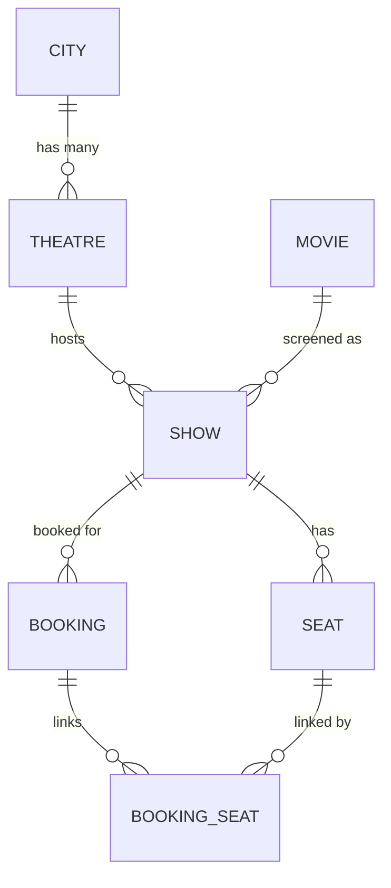

# Booking Platform

A Spring Boot movie ticket booking backend covering the full lifecycle — theatre onboarding, movie catalog, show scheduling, seat inventory, and ticket booking — with configurable pricing rules, in-process caching, and a Thymeleaf frontend.

---

## Table of Contents

1. [Tech Stack](#tech-stack)
2. [Features](#features)
3. [Architecture](#architecture)
4. [Domain Model](#domain-model)
5. [Project Structure](#project-structure)
6. [Pricing Rules](#pricing-rules)
7. [Caching](#caching)
8. [Getting Started](#getting-started)
9. [Running with Docker Compose](#running-with-docker-compose)
10. [Configuration](#configuration)
11. [API Quick Reference](#api-quick-reference)
12. [End-to-End cURL Walkthrough](#end-to-end-curl-walkthrough)
13. [Running Tests](#running-tests)
14. [OpenAPI / Swagger UI](#openapi--swagger-ui)
15. [Known Notes](#known-notes)
16. [Suggested Next Steps](#suggested-next-steps)

---

## Tech Stack

| Layer | Technology |
|---|---|
| Language | Java 21 |
| Framework | Spring Boot 4.0.0 |
| Web | Spring Web (REST) + Thymeleaf |
| Persistence | Spring Data JPA + Hibernate |
| Database | PostgreSQL 15 |
| Cache | Ehcache 3 via JCache (JSR-107) |
| Boilerplate | Lombok |
| API Docs | springdoc OpenAPI UI 3.0.2 |
| Build | Maven (wrapper included) |
| Container | Docker + Docker Compose |

---

## Features

- **Movie catalog** — create and list movies with genre and language filters
- **Theatre onboarding** — register theatres in cities; city is auto-created on first use
- **Show scheduling** — attach a movie and theatre to a date, time, and base ticket price
- **Seat inventory** — allocate named seat numbers per show; duplicate-safe
- **Show browsing** — filter shows by movie, city, and date
- **Seat availability** — view which seats are free or taken for a show
- **Ticket booking** — atomically reserve seats and compute the final price
- **Configurable pricing** — offer cities and theatres are YAML-driven, not hard-coded
- **Location directory** — country/city lookup backed by an external API with fallback
- **In-process caching** — Ehcache caches movie lookups and location data
- **Structured error responses** — every error returns `{ timestamp, status, error, message }`
- **Thymeleaf UI** — demo homepage served at `GET /` with live API console

---

## Architecture



---

## Domain Model



| Entity | Key Fields |
|---|---|
| `City` | `id`, `name (unique)` |
| `Theatre` | `id`, `name`, `city (FK)` |
| `Movie` | `id`, `title`, `genre`, `language` |
| `Show` | `id`, `movie (FK)`, `theatre (FK)`, `showDate`, `showTime`, `price` |
| `Seat` | `id`, `seatNumber`, `show (FK)`, `isBooked` |
| `Booking` | `id`, `show (FK)`, `seats (M2M)`, `totalPrice`, `createdAt` |

---

## Project Structure

```text
src/main/java/com/example/booking/
├── BookingPlatformApplication.java     ← @SpringBootApplication + @EnableCaching
├── config/
│   ├── CacheConfig.java                ← Ehcache / Redis bean stubs
│   └── PricingProperties.java          ← @ConfigurationProperties (offer cities/theatres)
├── controller/
│   ├── BookingController.java
│   ├── BrowseController.java
│   ├── LocationController.java
│   ├── MovieController.java
│   ├── PageController.java             ← Thymeleaf homepage
│   ├── PublicShowController.java
│   ├── ShowController.java
│   └── TheatreController.java
├── exception/
│   ├── ApiExceptionHandler.java        ← @RestControllerAdvice
│   ├── InvalidBookingRequestException.java
│   ├── ResourceNotFoundException.java
│   └── SeatUnavailableException.java
├── model/                              ← JPA entities + DTOs + records
├── repository/                         ← Spring Data JPA interfaces
└── service/
    ├── BookingService.java
    ├── BrowseService.java
    ├── LocationDirectoryService.java
    ├── MovieService.java
    ├── PricingEngine.java
    ├── ShowService.java
    └── TheatreService.java

src/main/resources/
├── application.yaml
├── application-dev.yml
├── createTables.sql
├── ehcache.xml
├── static/
│   ├── app.js
│   ├── styles.css
│   └── images/
└── templates/
    └── index.html
```

---

## Pricing Rules

`PricingEngine` applies two independent discounts in sequence:

```
1.  base = seats × show.price

2.  if seats ≥ 3
      AND show city + theatre match booking.pricing config
    then base -= show.price × 0.50        ← 50% off the 3rd ticket

3.  if 12:00 ≤ showTime < 16:00
    then base *= 0.80                      ← 20% afternoon discount
```

Offer-eligible cities and theatres are set in `application-dev.yml`:

```yaml
booking:
  pricing:
    third-ticket-offer-cities:
      - Mumbai
      - Bengaluru
    third-ticket-offer-theatres:
      - PVR Andheri
      - Forum Mall Screens
```

Both lists must match for the 3rd-ticket discount to apply when both are configured.

### Pricing Examples

| Scenario | Seats | Price | City / Theatre | Time | Total |
|---|---|---|---|---|---|
| Both discounts | 3 | ₹100 | Mumbai / PVR Andheri | 13:00 | **₹200.00** |
| Afternoon only | 3 | ₹100 | Delhi / Downtown | 13:00 | **₹240.00** |
| 3rd-ticket only | 3 | ₹200 | Mumbai / PVR Andheri | 18:00 | **₹500.00** |
| No discount | 2 | ₹150 | Delhi / Downtown | 18:00 | **₹300.00** |

---

## Caching

Caching is enabled globally via `@EnableCaching` in `BookingPlatformApplication`.

| Cache | Method | Key | TTL |
|---|---|---|---|
| `movies` | `MovieService#getMovieById` | movie `id` | 60 min |
| `locationDirectory` | `LocationDirectoryService#getCountryDirectory` | `"all"` | 180 min |
| `locationCountries` | `LocationDirectoryService#getCountries` | `"all"` | 180 min |
| `locationCities` | `LocationDirectoryService#getCities` | `country` (lowercase) | 180 min |

Ehcache is configured in `src/main/resources/ehcache.xml`. Redis is provisioned in `docker-compose.yml` as a future option but is not the active cache backend.

---

## Getting Started

### Prerequisites

- Java 21
- Maven (or use the included `mvnw` / `mvnw.cmd` wrapper)
- PostgreSQL 15 running locally on port `5432` with a database named `booking_db`

### Option 1 — Maven wrapper (Linux / macOS)

```bash
./mvnw spring-boot:run
```

### Option 2 — Maven wrapper (Windows)

```powershell
.\mvnw.cmd spring-boot:run
```

### Option 3 — Build JAR and run

```bash
./mvnw clean package
java -jar target/booking-platform-0.0.1-SNAPSHOT.jar
```

The app starts at `http://localhost:8080`.

---

## Running with Docker Compose

The `docker-compose.yml` spins up three services:

| Service | Image | Port |
|---|---|---|
| `db` | postgres:15 | 5432 |
| `redis` | redis:8 | 6379 |
| `app` | Built from `Dockerfile` | 8080 |

```bash
docker-compose up --build
```

Environment variables passed to the app container:

| Variable | Default |
|---|---|
| `DB_USER` | `postgres` |
| `DB_PASS` | `postgres` |

---

## Configuration

### `src/main/resources/application.yaml`

```yaml
spring:
  application:
    name: booking-platform
  profiles:
    active: dev
```

### `src/main/resources/application-dev.yml`

```yaml
spring:
  datasource:
    url: jdbc:postgresql://localhost:5432/booking_db
    username: ${DB_USER:postgres}
    password: ${DB_PASS:postgres}
  jpa:
    hibernate:
      ddl-auto: update
  cache:
    type: jcache
    jcache:
      config: classpath:ehcache.xml

booking:
  pricing:
    third-ticket-offer-cities:
      - Mumbai
      - Bengaluru
    third-ticket-offer-theatres:
      - PVR Andheri
      - Forum Mall Screens
```

### Database Setup

Schema is managed by Hibernate (`ddl-auto: update`). A reference DDL script is also available at `src/main/resources/createTables.sql` if you prefer to manage the schema manually.

Local defaults: database `booking_db`, username `postgres`, password `postgres`.

---

## API Quick Reference

> Base URL: `http://localhost:8080`

### Partner APIs — setup flow

| Method | Path | Description |
|---|---|---|
| `POST` | `/partners/theatres` | Onboard a theatre in a city |
| `GET` | `/partners/theatres` | List theatres (optional `?city=` filter) |
| `GET` | `/partners/theatres/cities` | List all onboarded cities |
| `POST` | `/partners/shows` | Create a show |
| `POST` | `/partners/shows/{showId}/seats` | Allocate seat numbers for a show |

### Customer APIs — booking flow

| Method | Path | Description |
|---|---|---|
| `GET` | `/browse/shows` | Browse shows by `movieId`, `city`, and `date` |
| `GET` | `/shows/{showId}/seats` | View seat availability for a show |
| `POST` | `/bookings` | Book seats for a show |
| `GET` | `/bookings/{id}` | Fetch a booking by ID |

### Catalog APIs

| Method | Path | Description |
|---|---|---|
| `POST` | `/movies` | Create a movie |
| `GET` | `/movies` | List movies (optional `?genre=` / `?language=` filters) |
| `GET` | `/movies/{id}` | Get a movie by ID (cached) |

### Location APIs

| Method | Path | Description |
|---|---|---|
| `GET` | `/ui/locations/countries` | List all countries |
| `GET` | `/ui/locations/cities` | List cities for a country (defaults to India) |

---

## End-to-End cURL Walkthrough

The following script seeds a complete scenario and makes a booking. Copy and run it against a live instance.

```bash
# 1. Create a movie
MOVIE_ID=$(curl -s -X POST http://localhost:8080/movies \
  -H "Content-Type: application/json" \
  -d '{"title":"Interstellar","genre":"Sci-Fi","language":"English"}' \
  | jq -r '.id')
echo "Movie ID: $MOVIE_ID"

# 2. Onboard a theatre (city is auto-created)
THEATRE_ID=$(curl -s -X POST http://localhost:8080/partners/theatres \
  -H "Content-Type: application/json" \
  -d '{"theatreName":"PVR Andheri","cityName":"Mumbai"}' \
  | jq -r '.id')
echo "Theatre ID: $THEATRE_ID"

# 3. Create an afternoon show — eligible for both discounts
SHOW_ID=$(curl -s -X POST http://localhost:8080/partners/shows \
  -H "Content-Type: application/json" \
  -d "{
    \"movieId\": $MOVIE_ID,
    \"theatreId\": $THEATRE_ID,
    \"showDate\": \"2026-04-10\",
    \"showTime\": \"13:00\",
    \"price\": 100.0
  }" | jq -r '.id')
echo "Show ID: $SHOW_ID"

# 4. Allocate seats
curl -s -X POST http://localhost:8080/partners/shows/$SHOW_ID/seats \
  -H "Content-Type: application/json" \
  -d '{"seatNumbers":["A1","A2","A3","A4","A5"]}' | jq .

# 5. Browse shows
curl -s "http://localhost:8080/browse/shows?movieId=$MOVIE_ID&city=Mumbai&date=2026-04-10" | jq .

# 6. Check seat availability
curl -s http://localhost:8080/shows/$SHOW_ID/seats | jq .

# 7. Book 3 seats → both discounts apply → totalPrice = 200.0
BOOKING_ID=$(curl -s -X POST http://localhost:8080/bookings \
  -H "Content-Type: application/json" \
  -d "{\"showId\": $SHOW_ID, \"seats\": [\"A1\", \"A2\", \"A3\"]}" \
  | jq -r '.id')
echo "Booking ID: $BOOKING_ID"

# 8. Fetch the completed booking
curl -s http://localhost:8080/bookings/$BOOKING_ID | jq .
```

Expected `totalPrice` for step 7: **₹200.0**
- base: 3 × ₹100 = ₹300
- 3rd-ticket offer: −₹50 → ₹250
- afternoon discount: × 0.8 → **₹200**

---

## Running Tests

```bash
./mvnw test
```

Test classes:

| Class | What it covers |
|---|---|
| `BookingServiceTest` | Both discounts, afternoon-only, unknown seat, already-booked seat |
| `BrowseServiceTest` | Delegation to `ShowRepository` |
| `PricingEngineTest` | Eligible vs non-eligible location, discount stacking |
| `TheatreServiceTest` | Auto-create city, duplicate theatre rejection |

All tests are pure unit tests using Mockito — no database or Spring context required.

---

## OpenAPI / Swagger UI

Once the application is running:

```
http://localhost:8080/swagger-ui/index.html
```

Raw OpenAPI spec:

```bash
curl -s http://localhost:8080/v3/api-docs | jq .
```

---

## Known Notes

1. **No authentication** — all `/partners/**` endpoints are publicly accessible. Add Spring Security before any production deployment.
2. **No seat-level concurrency control** — two simultaneous requests for the same seat can both pass the availability check before either commits. Add `@Lock(LockModeType.PESSIMISTIC_WRITE)` to the seat query to prevent this.
3. **Entities returned from controllers** — JPA entities are serialized directly. Introduce response DTOs to decouple the API contract from the persistence model.
4. **Redis provisioned but inactive** — Redis is in `docker-compose.yml` and partially wired in `CacheConfig.java`, but Ehcache is the active cache backend for this version.
5. **`Optional<Movie>` is cached** — an empty `Optional` (movie not found) is also cached, so a missing movie will not be re-fetched until the TTL expires.

---

## Suggested Next Steps

**Short-term**
- Add `@Lock(LockModeType.PESSIMISTIC_WRITE)` on seat fetch inside `BookingService` to eliminate the concurrency gap
- Add `@NotNull` / `@NotBlank` Bean Validation on all request DTOs and enable `@Valid` in controllers
- Introduce response record types for all controllers to decouple the API from JPA entities
- Add integration tests with `@SpringBootTest` + Testcontainers for PostgreSQL

**Medium-term**
- Secure `/partners/**` with Spring Security (API key or JWT)
- Add pagination to `GET /movies` and `GET /browse/shows`
- Add `@CacheEvict` when a movie is updated or deleted
- Add a `GET /partners/shows/{showId}` management endpoint

**Long-term**
- Seat hold / expiry workflow (reserve for N minutes before confirming)
- Activate Redis when the platform scales to multiple instances
- Expose Prometheus metrics via Spring Boot Actuator
- Add a dedicated admin API separate from the partner-facing surface

---

> For the full detailed design including all sequence diagrams, pricing flowcharts, and complete cURL documentation, see [`design.md`](design.md).