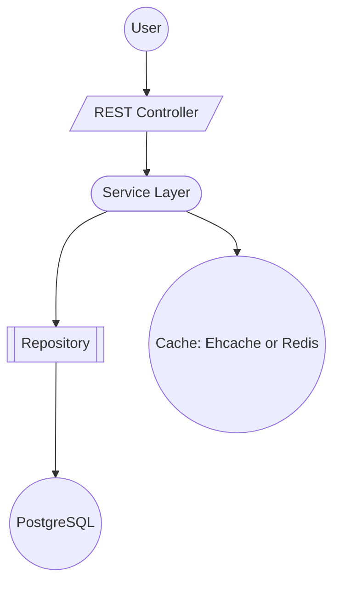

# Booking Platform

## Overview
This project is a Spring Boot movie ticket booking platform built with Java 21, Spring Web, Spring Data JPA, PostgreSQL, and Spring Cache.

The application currently supports:

- creating and fetching movies
- browsing shows by movie, city, and date
- booking seats for a show
- caching movie and browse lookups with JCache/Ehcache
- container-based local setup with Docker Compose

## Tech Stack
- Java 21
- Spring Boot 4.0.0
- Spring Web
- Spring Data JPA
- PostgreSQL
- Ehcache via JCache
- Lombok
- springdoc OpenAPI UI

## Project Structure
```text
src/main/java/com/example/booking
|-- BookingPlatformApplication.java
|-- config/
|-- controller/
|-- model/
|-- repository/
`-- service/

src/main/resources
|-- application.yaml
|-- application-dev.yml
|-- createTables.sql
`-- ehcache.xml
```

## Architecture Diagram


## Domain Model
The main entities are:

- `City`: a supported city
- `Theatre`: belongs to a city
- `Movie`: title, genre, and language
- `Show`: connects a movie and theatre with date, time, and base price
- `Seat`: belongs to a show and tracks booking status
- `Booking`: stores the selected show, seats, total price, and creation time

Relationship summary:

- one city can have many theatres
- one movie can have many shows
- one theatre can host many shows
- one show can have many seats
- one booking belongs to one show
- one booking can contain many seats

## Pricing Rules
`PricingEngine` applies the following pricing logic:

1. Base total = `number of seats x show price`
2. If 3 or more seats are booked and the show is in a configured offer city or theatre, the 3rd ticket gets a 50% discount
3. If the show time is between 12:00 PM and 4:00 PM, the total gets a 20% discount

## API Endpoints
Base URL:

```text
http://localhost:8080
```

### Movie APIs
#### Create movie
```http
POST /movies
Content-Type: application/json
```

Example request:
```json
{
  "title": "Interstellar",
  "genre": "Sci-Fi",
  "language": "English"
}
```

#### List movies
```http
GET /movies?genre={genre}&language={language}
```

Example:
```http
GET /movies?genre=Sci-Fi&language=English
```

#### Get movie by id
```http
GET /movies/{id}
```

Example:
```http
GET /movies/1
```

### Browse APIs
#### Find shows
```http
GET /browse/shows?movieId={movieId}&city={cityName}&date={yyyy-MM-dd}
```

Example:
```http
GET /browse/shows?movieId=1&city=Mumbai&date=2026-04-04
```

### Booking APIs
#### Book seats for a show
```http
POST /bookings
Content-Type: application/json
```

Example request:
```json
{
  "showId": 1,
  "seats": ["A1", "A2", "A3"]
}
```

#### Get booking by id
```http
GET /bookings/{id}
```

Example:
```http
GET /bookings/1
```

### Theatre Partner APIs
#### Onboard theatre
```http
POST /partners/theatres
Content-Type: application/json
```

Example request:
```json
{
  "theatreName": "PVR Andheri",
  "cityName": "Mumbai"
}
```

## OpenAPI and Swagger UI
The project includes `springdoc-openapi-starter-webmvc-ui`, so once the application starts successfully you should be able to access Swagger UI at:

```text
http://localhost:8080/swagger-ui/index.html
```

## Configuration
`src/main/resources/application.yaml`

- sets application name to `booking-platform`
- activates the `dev` profile by default

`src/main/resources/application-dev.yml`

- PostgreSQL URL: `jdbc:postgresql://localhost:5432/booking_db`
- default DB user: `postgres`
- default DB password: `postgres`
- Hibernate DDL mode: `update`
- cache type: `jcache`
- cache config: `classpath:ehcache.xml`
- third-ticket offer cities and theatres are configurable under `booking.pricing`

Environment variables:

- `DB_USER`
- `DB_PASS`

## Database Setup
The application is configured to use PostgreSQL database `booking_db` on port `5432`.

You can use either:

- JPA schema generation with `spring.jpa.hibernate.ddl-auto=update`
- the provided SQL file at `src/main/resources/createTables.sql`

Local defaults:

- database: `booking_db`
- username: `postgres`
- password: `postgres`

## Running Locally
### Option 1: Run with Maven Wrapper
From the project root:

```powershell
.\mvnw.cmd spring-boot:run
```

### Option 2: Build JAR and run
```powershell
.\mvnw.cmd clean package
java -jar target\booking-platform-0.0.1-SNAPSHOT.jar
```

## Running with Docker Compose
The repo contains:

- `db`: PostgreSQL 15
- `redis`: Redis 8
- `app`: Spring Boot application

Run:

```powershell
docker-compose up --build
```

Exposed ports:

- app: `8080`
- postgres: `5432`
- redis: `6379`

## Caching
Caching is enabled globally through `@EnableCaching` in the main application class.

Current cached paths in the codebase:

- movie lookup in `MovieService#getMovieById`
- movie lookup in `MovieController#getMovie`
- booking lookup in `BookingController#getBooking`
- browse lookup in `BrowseController#getShows`

Ehcache configuration is stored in `src/main/resources/ehcache.xml`.

## Why Ehcache Instead Of Redis
The current project is configured to use Ehcache through JCache even though Docker Compose also provisions Redis.

Ehcache was the better fit for the current implementation because:

- the application is presently designed as a single Spring Boot service
- the main cache need is fast local caching for read-heavy lookups such as movies and browse results
- Ehcache works in-process, so there is no extra network hop for cache reads
- it keeps local development simpler because the app can cache effectively without depending on an external cache service
- the current cache footprint is small and well suited to in-memory local caching

Redis is still present in the repository as a future-ready option, but it is not the active cache backend for this version of the project.

### Ehcache vs Redis
| Area | Ehcache | Redis |
|---|---|---|
| Deployment model | Embedded in the application JVM | Separate cache server |
| Network hop | No | Yes |
| Setup complexity | Low | Medium |
| Best fit | Single-instance application caching | Shared cache across multiple app instances |
| Operational overhead | Low | Higher |
| Local development | Simple | Requires external service |
| Horizontal scaling support | Limited | Strong |
| Current fit for this project | Strong | Future option |

### Current Decision
For this booking platform, Ehcache is the preferred default because the current codebase is optimized for a simple, single-application deployment and does not yet require distributed cache coordination.

## Repository Layer
Custom repository queries currently used:

- `ShowRepository#findByMovieIdAndTheatreCityNameAndShowDate`
- `SeatRepository#findByShowIdAndSeatNumberIn`

These support:

- filtering shows by movie, city, and date
- resolving requested seats for a specific show during booking

## Known Implementation Notes
These are important if you plan to extend or run the project:

1. `BookingController` currently defines two `@PostMapping` methods on `/bookings`. If both remain enabled, Spring MVC mapping will conflict and should be consolidated into distinct routes.
2. `Dockerfile` copies `target/booking-0.0.1-SNAPSHOT.jar`, but the Maven artifact name produced by this project is `booking-platform-0.0.1-SNAPSHOT.jar`.
3. `Booking.createdAt` is marked non-null in the entity, but `BookingService` does not currently set it before saving a booking.
4. The root-level `createTables.sql` and the resource SQL file are not fully aligned with the JPA model. Prefer the entity model as the source of truth.
5. The current test class exists, but the default context load test is commented out.

## Suggested Next Improvements
- split booking creation and admin save flows into separate endpoints
- add validation for missing or invalid seat numbers
- set `createdAt` automatically with `@PrePersist`
- add proper exception handling with structured API error responses
- add integration tests for booking, browsing, and pricing
- align Docker packaging and SQL schema with the current entity model
