# Booking Platform — Detailed Design Document

## Table of Contents

1. [Purpose](#purpose)
2. [System Overview](#system-overview)
3. [Architecture Diagram](#architecture-diagram)
4. [Component Architecture](#component-architecture)
5. [Domain Model](#domain-model)
6. [Entity Relationship Diagram](#entity-relationship-diagram)
7. [Layered Architecture](#layered-architecture)
8. [Booking Flow — Sequence Diagram](#booking-flow--sequence-diagram)
9. [Theatre Onboarding Flow](#theatre-onboarding-flow)
10. [Show Creation Flow](#show-creation-flow)
11. [Pricing Engine Design](#pricing-engine-design)
12. [Caching Design](#caching-design)
13. [Exception Handling Design](#exception-handling-design)
14. [Persistence Design](#persistence-design)
15. [Deployment Architecture](#deployment-architecture)
16. [Configuration Reference](#configuration-reference)
17. [REST API Reference & cURL Examples](#rest-api-reference--curl-examples)
18. [Design Strengths](#design-strengths)
19. [Known Gaps and Risks](#known-gaps-and-risks)
20. [Recommended Next Steps](#recommended-next-steps)

---

## Purpose

This document describes the complete technical design of the **Booking Platform** — a Spring Boot movie ticket booking backend. It captures the architectural decisions, domain model, component interactions, data flows, caching strategy, and the full API surface with executable cURL examples.

The system supports:

- theatre partner onboarding (cities, theatres)
- movie catalog management
- show scheduling and seat inventory allocation
- customer show browsing by movie, city, and date
- seat selection and ticket booking with configurable pricing rules
- location directory lookup backed by an external API with caching

---

## System Overview

The application follows a **standard layered Spring Boot architecture**:

- **Controller layer** — HTTP REST endpoints and one Thymeleaf page
- **Service layer** — business logic, orchestration, pricing, and external API integration
- **Repository layer** — Spring Data JPA interfaces for PostgreSQL
- **Entity model** — JPA-mapped relational domain
- **Cache layer** — Ehcache via JCache (JSR-107), with Redis provisioned as a future option
- **Frontend** — Thymeleaf + vanilla JS single-page application served at `GET /`

---

## Architecture Diagram

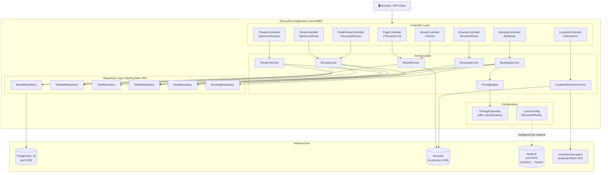

---

## Component Architecture

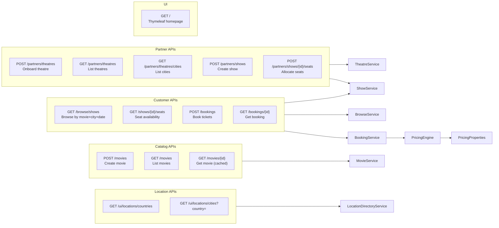

---

## Domain Model

### Entities

| Entity | Table | Key Fields |
|---|---|---|
| `City` | `city` | `id`, `name (unique)` |
| `Theatre` | `theatre` | `id`, `name`, `city (FK)` |
| `Movie` | `movie` | `id`, `title`, `genre`, `language` |
| `Show` | `show` | `id`, `movie (FK)`, `theatre (FK)`, `showDate`, `showTime`, `price` |
| `Seat` | `seat` | `id`, `seatNumber`, `show (FK)`, `isBooked` |
| `Booking` | `booking` | `id`, `show (FK)`, `seats (M2M)`, `totalPrice`, `createdAt` |

### Request / Response Types (non-entity)

| Type | Kind | Purpose |
|---|---|---|
| `BookingRequest` | DTO | `showId` + `List<String> seats` |
| `ShowRequest` | DTO | `movieId`, `theatreId`, `showDate`, `showTime`, `price` |
| `SeatInventoryRequest` | DTO | `List<String> seatNumbers` |
| `TheatreOnboardingRequest` | DTO | `theatreName`, `cityName` |
| `TheatreResponse` | Record | `id`, `theatreName`, `cityName` |
| `SeatAvailabilityResponse` | Record | `id`, `seatNumber`, `booked` |

---

## Entity Relationship Diagram

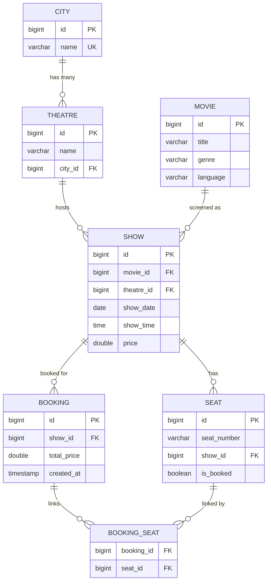

---

## Layered Architecture

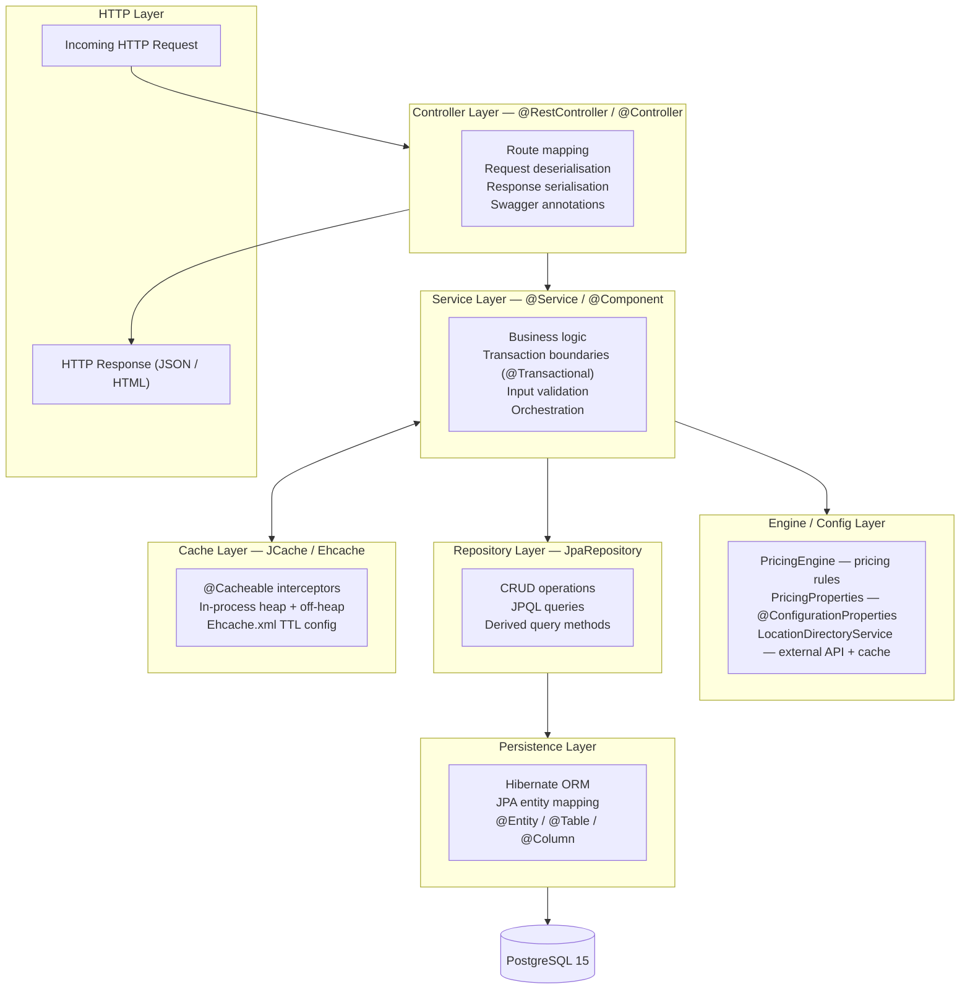

---

## Booking Flow — Sequence Diagram

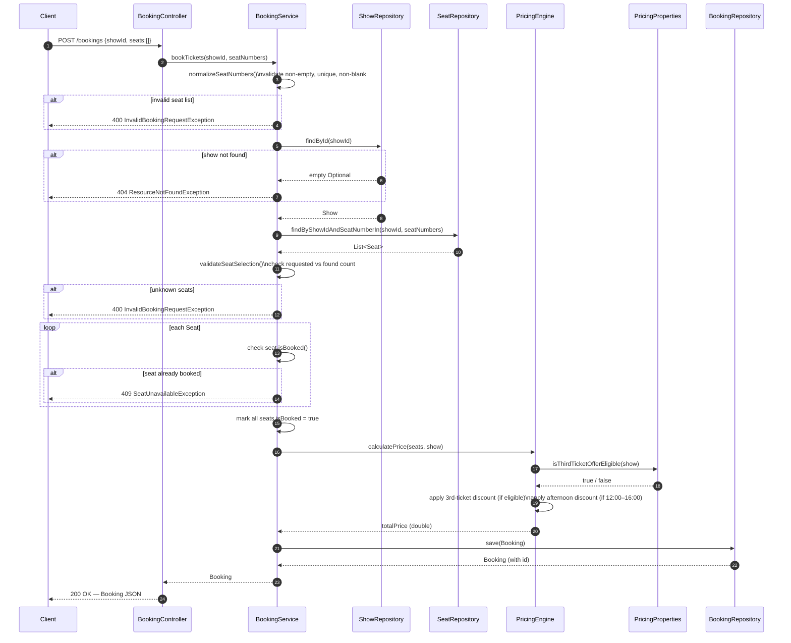

---

## Theatre Onboarding Flow

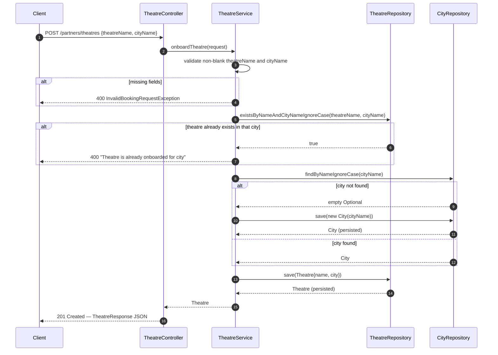

---

## Show Creation Flow

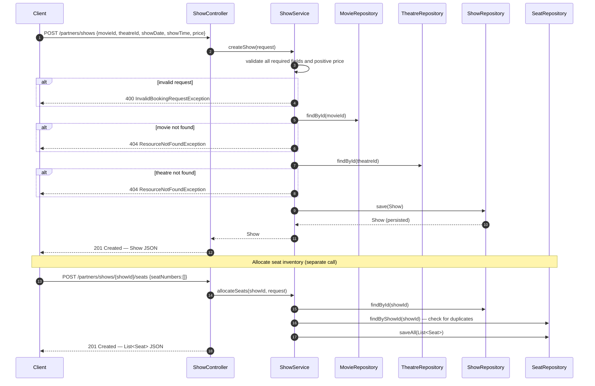

---

## Pricing Engine Design

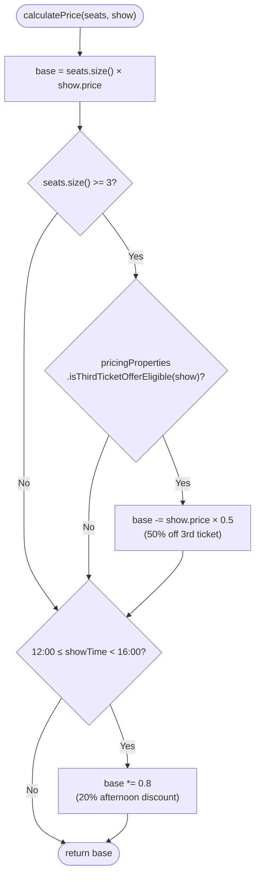

### Pricing Properties Logic

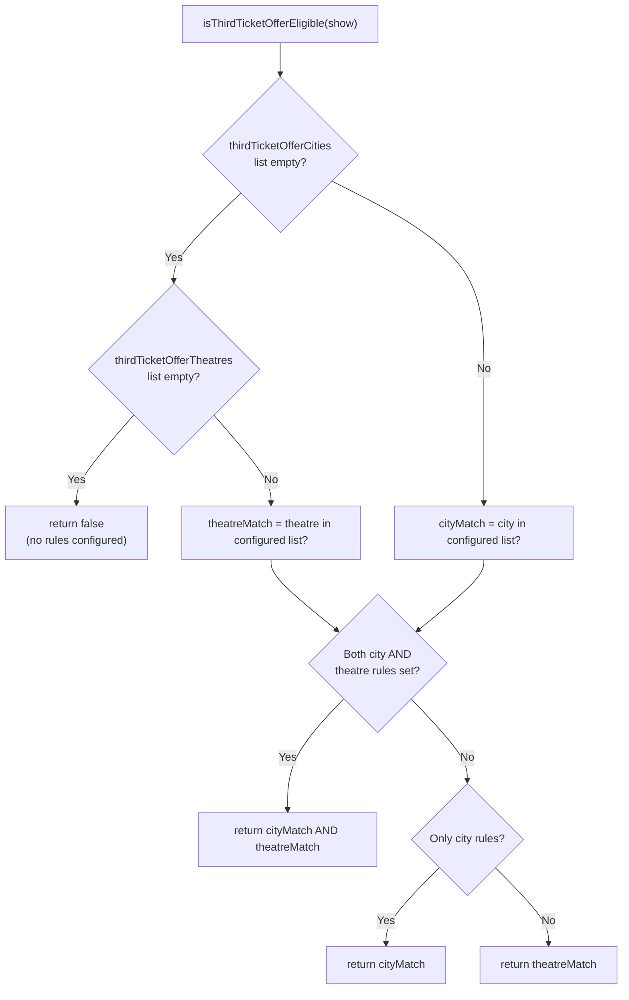

### Pricing Examples

| Scenario | Seats | Price | City / Theatre | Time | Total |
|---|---|---|---|---|---|
| Eligible location + afternoon | 3 | ₹100 | Mumbai / PVR Andheri | 13:00 | **₹200.0** |
| Non-eligible location + afternoon | 3 | ₹100 | Delhi / Downtown Screens | 13:00 | **₹240.0** |
| Eligible location + evening | 3 | ₹200 | Mumbai / PVR Andheri | 18:00 | **₹500.0** |
| Non-eligible + evening, fewer seats | 2 | ₹150 | Delhi / Downtown Screens | 18:00 | **₹300.0** |

---

## Caching Design

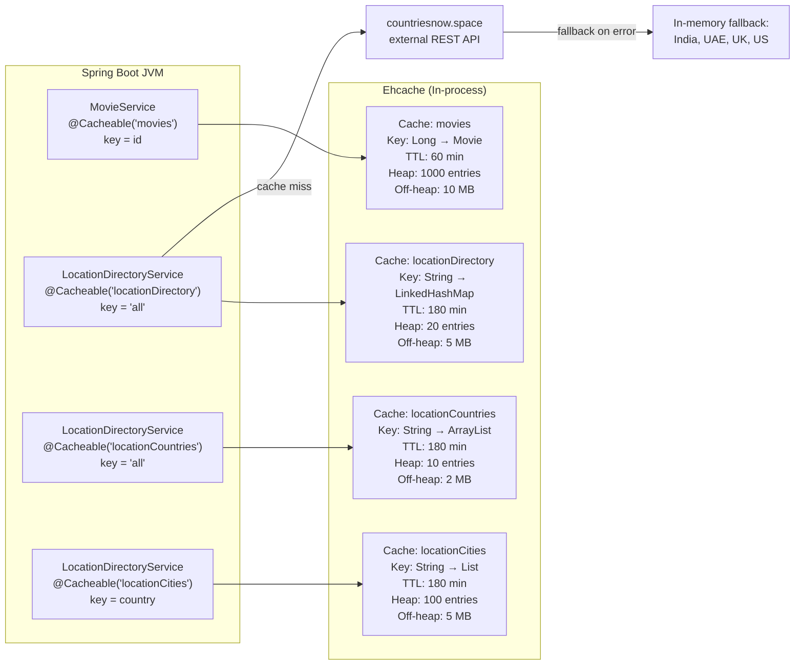

### Cache Summary

| Cache Name | Key | Value Type | TTL | Heap | Off-Heap |
|---|---|---|---|---|---|
| `movies` | `Long` (movie id) | `Movie` | 60 min | 1 000 entries | 10 MB |
| `locationDirectory` | `"all"` | `LinkedHashMap<String, List<String>>` | 180 min | 20 entries | 5 MB |
| `locationCountries` | `"all"` | `ArrayList<String>` | 180 min | 10 entries | 2 MB |
| `locationCities` | `country` (lowercase) | `List<String>` | 180 min | 100 entries | 5 MB |

### Ehcache vs Redis Decision

| Area | Ehcache (active) | Redis (future) |
|---|---|---|
| Deployment model | Embedded in JVM | External standalone server |
| Network hop | None | Yes |
| Setup complexity | Low | Medium |
| Local dev experience | Excellent | Requires external service |
| Horizontal scaling | Limited | Strong |
| Shared cache across replicas | No | Yes |
| Current fit | ✅ Ideal | 🔜 Future path |

---

## Exception Handling Design

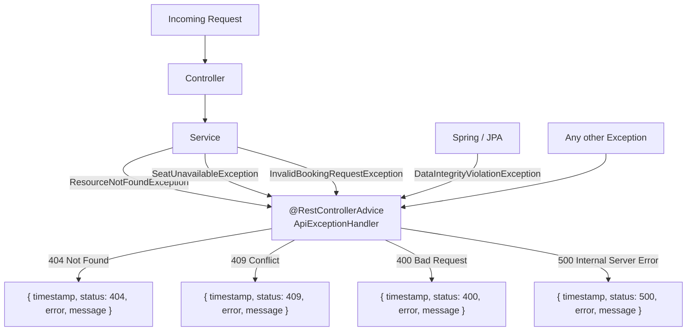

### Error Response Shape

```json
{
  "timestamp": "2026-04-04T14:30:00",
  "status": 404,
  "error": "Not Found",
  "message": "Show not found: 99"
}
```

---

## Persistence Design

### Schema (createTables.sql)

```sql
CREATE TABLE city (
    id   SERIAL PRIMARY KEY,
    name VARCHAR(100) NOT NULL UNIQUE
);

CREATE TABLE theatre (
    id      SERIAL PRIMARY KEY,
    name    VARCHAR(100) NOT NULL,
    city_id INT NOT NULL REFERENCES city(id)
);

CREATE TABLE movie (
    id       SERIAL PRIMARY KEY,
    title    VARCHAR(100) NOT NULL,
    genre    VARCHAR(50)  NOT NULL,
    language VARCHAR(50)  NOT NULL
);

CREATE TABLE show (
    id         SERIAL PRIMARY KEY,
    movie_id   INT    NOT NULL REFERENCES movie(id),
    theatre_id INT    NOT NULL REFERENCES theatre(id),
    show_date  DATE   NOT NULL,
    show_time  TIME   NOT NULL,
    price      DOUBLE PRECISION NOT NULL
);

CREATE TABLE seat (
    id          SERIAL PRIMARY KEY,
    show_id     INT          NOT NULL REFERENCES show(id),
    seat_number VARCHAR(10)  NOT NULL,
    is_booked   BOOLEAN      DEFAULT FALSE,
    UNIQUE (show_id, seat_number)
);

CREATE TABLE booking (
    id          SERIAL PRIMARY KEY,
    show_id     INT    NOT NULL REFERENCES show(id),
    total_price DOUBLE PRECISION NOT NULL,
    created_at  TIMESTAMP DEFAULT CURRENT_TIMESTAMP
);

CREATE TABLE booking_seat (
    booking_id INT NOT NULL REFERENCES booking(id),
    seat_id    INT NOT NULL REFERENCES seat(id),
    PRIMARY KEY (booking_id, seat_id)
);
```

### Custom JPQL Queries

```java
// ShowRepository — filter by movie, city (case-insensitive), and date
@Query("""
    select s from Show s
    where s.movie.id = :movieId
      and lower(s.theatre.city.name) = lower(:city)
      and s.showDate = :showDate
    """)
List<Show> findShowsByMovieCityAndDate(Long movieId, String city, LocalDate showDate);

// TheatreRepository — duplicate check (case-insensitive)
@Query("""
    select count(t) > 0 from Theatre t
    where lower(t.name) = lower(:name)
      and lower(t.city.name) = lower(:cityName)
    """)
boolean existsByNameAndCityNameIgnoreCase(String name, String cityName);

// TheatreRepository — optional city filter, ordered
@Query("""
    select t from Theatre t
    where (:cityName is null or lower(t.city.name) = lower(:cityName))
    order by t.city.name asc, t.name asc
    """)
List<Theatre> findByOptionalCityOrdered(String cityName);
```

---

## Deployment Architecture

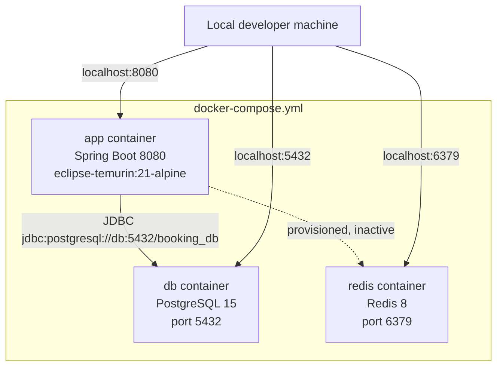

### Dockerfile

```dockerfile
FROM eclipse-temurin:21-jdk-alpine
VOLUME /tmp
COPY target/booking-platform-0.0.1-SNAPSHOT.jar app.jar
EXPOSE 8080
ENTRYPOINT ["java", "-jar", "/app.jar"]
```

---

## Configuration Reference

### `application.yaml`

```yaml
spring:
  application:
    name: booking-platform
  profiles:
    active: dev
```

### `application-dev.yml`

```yaml
spring:
  datasource:
    url: jdbc:postgresql://localhost:5432/booking_db
    username: ${DB_USER:postgres}
    password: ${DB_PASS:postgres}
  jpa:
    hibernate:
      ddl-auto: update
  cache:
    type: jcache
    jcache:
      config: classpath:ehcache.xml

booking:
  pricing:
    third-ticket-offer-cities:
      - Mumbai
      - Bengaluru
    third-ticket-offer-theatres:
      - PVR Andheri
      - Forum Mall Screens
```

### Environment Variables

| Variable | Default | Description |
|---|---|---|
| `DB_USER` | `postgres` | PostgreSQL username |
| `DB_PASS` | `postgres` | PostgreSQL password |

---

## REST API Reference & cURL Examples

> Base URL: `http://localhost:8080`

---

### 1. Movie APIs

#### `POST /movies` — Create a movie

**Request**
```json
{
  "title": "Interstellar",
  "genre": "Sci-Fi",
  "language": "English"
}
```

**cURL**
```bash
curl -s -X POST http://localhost:8080/movies \
  -H "Content-Type: application/json" \
  -d '{"title":"Interstellar","genre":"Sci-Fi","language":"English"}' | jq .
```

**Response `200 OK`**
```json
{
  "id": 1,
  "title": "Interstellar",
  "genre": "Sci-Fi",
  "language": "English"
}
```

---

#### `GET /movies` — List all movies (with optional filters)

**cURL — all movies**
```bash
curl -s http://localhost:8080/movies | jq .
```

**cURL — filter by genre**
```bash
curl -s "http://localhost:8080/movies?genre=Sci-Fi" | jq .
```

**cURL — filter by language**
```bash
curl -s "http://localhost:8080/movies?language=English" | jq .
```

**cURL — filter by genre and language**
```bash
curl -s "http://localhost:8080/movies?genre=Sci-Fi&language=English" | jq .
```

**Response `200 OK`**
```json
[
  {
    "id": 1,
    "title": "Interstellar",
    "genre": "Sci-Fi",
    "language": "English"
  }
]
```

---

#### `GET /movies/{id}` — Get movie by ID (cache-enabled)

**cURL**
```bash
curl -s http://localhost:8080/movies/1 | jq .
```

**Response `200 OK`**
```json
{
  "id": 1,
  "title": "Interstellar",
  "genre": "Sci-Fi",
  "language": "English"
}
```

**Response `404 Not Found`**
```json
{
  "timestamp": "2026-04-04T14:30:00",
  "status": 404,
  "error": "Not Found",
  "message": "Movie not found: 99"
}
```

---

### 2. Partner — Theatre APIs

#### `POST /partners/theatres` — Onboard a theatre

**Request**
```json
{
  "theatreName": "PVR Andheri",
  "cityName": "Mumbai"
}
```

**cURL**
```bash
curl -s -X POST http://localhost:8080/partners/theatres \
  -H "Content-Type: application/json" \
  -d '{"theatreName":"PVR Andheri","cityName":"Mumbai"}' | jq .
```

**Response `201 Created`**
```json
{
  "id": 1,
  "theatreName": "PVR Andheri",
  "cityName": "Mumbai"
}
```

**Response `400 Bad Request` (duplicate)**
```json
{
  "timestamp": "2026-04-04T14:30:00",
  "status": 400,
  "error": "Bad Request",
  "message": "Theatre is already onboarded for city: Mumbai"
}
```

---

#### `GET /partners/theatres` — List theatres (optional city filter)

**cURL — all theatres**
```bash
curl -s http://localhost:8080/partners/theatres | jq .
```

**cURL — filter by city**
```bash
curl -s "http://localhost:8080/partners/theatres?city=Mumbai" | jq .
```

**Response `200 OK`**
```json
[
  {
    "id": 1,
    "theatreName": "PVR Andheri",
    "cityName": "Mumbai"
  },
  {
    "id": 2,
    "theatreName": "Forum Mall Screens",
    "cityName": "Bengaluru"
  }
]
```

---

#### `GET /partners/theatres/cities` — List all onboarded cities

**cURL**
```bash
curl -s http://localhost:8080/partners/theatres/cities | jq .
```

**Response `200 OK`**
```json
["Bengaluru", "Mumbai"]
```

---

### 3. Partner — Show APIs

#### `POST /partners/shows` — Create a show

**Request**
```json
{
  "movieId": 1,
  "theatreId": 1,
  "showDate": "2026-04-10",
  "showTime": "13:00",
  "price": 100.0
}
```

**cURL**
```bash
curl -s -X POST http://localhost:8080/partners/shows \
  -H "Content-Type: application/json" \
  -d '{
    "movieId": 1,
    "theatreId": 1,
    "showDate": "2026-04-10",
    "showTime": "13:00",
    "price": 100.0
  }' | jq .
```

**Response `201 Created`**
```json
{
  "id": 1,
  "movie": { "id": 1, "title": "Interstellar", "genre": "Sci-Fi", "language": "English" },
  "theatre": { "id": 1, "name": "PVR Andheri", "city": { "id": 1, "name": "Mumbai" } },
  "showDate": "2026-04-10",
  "showTime": "13:00:00",
  "price": 100.0
}
```

**Response `400 Bad Request` (missing field)**
```json
{
  "timestamp": "2026-04-04T14:30:00",
  "status": 400,
  "error": "Bad Request",
  "message": "movieId, theatreId, showDate, showTime, and positive price are required"
}
```

---

#### `POST /partners/shows/{showId}/seats` — Allocate seat inventory

**Request**
```json
{
  "seatNumbers": ["A1", "A2", "A3", "A4", "A5"]
}
```

**cURL**
```bash
curl -s -X POST http://localhost:8080/partners/shows/1/seats \
  -H "Content-Type: application/json" \
  -d '{"seatNumbers":["A1","A2","A3","A4","A5"]}' | jq .
```

**Response `201 Created`**
```json
[
  { "id": 1, "seatNumber": "A1", "show": { "id": 1 }, "booked": false },
  { "id": 2, "seatNumber": "A2", "show": { "id": 1 }, "booked": false },
  { "id": 3, "seatNumber": "A3", "show": { "id": 1 }, "booked": false }
]
```

**Response `400 Bad Request` (duplicate seat)**
```json
{
  "timestamp": "2026-04-04T14:30:00",
  "status": 400,
  "error": "Bad Request",
  "message": "Seat(s) already allocated: A1, A2"
}
```

---

### 4. Customer — Browse APIs

#### `GET /browse/shows` — Browse shows by movie, city, and date

**cURL**
```bash
curl -s "http://localhost:8080/browse/shows?movieId=1&city=Mumbai&date=2026-04-10" | jq .
```

**Response `200 OK`**
```json
[
  {
    "id": 1,
    "movie": { "id": 1, "title": "Interstellar", "genre": "Sci-Fi", "language": "English" },
    "theatre": {
      "id": 1,
      "name": "PVR Andheri",
      "city": { "id": 1, "name": "Mumbai" }
    },
    "showDate": "2026-04-10",
    "showTime": "13:00:00",
    "price": 100.0
  }
]
```

---

### 5. Customer — Seat Availability

#### `GET /shows/{showId}/seats` — View seat availability for a show

**cURL**
```bash
curl -s http://localhost:8080/shows/1/seats | jq .
```

**Response `200 OK`**
```json
[
  { "id": 1, "seatNumber": "A1", "booked": false },
  { "id": 2, "seatNumber": "A2", "booked": false },
  { "id": 3, "seatNumber": "A3", "booked": true },
  { "id": 4, "seatNumber": "A4", "booked": false },
  { "id": 5, "seatNumber": "A5", "booked": false }
]
```

---

### 6. Customer — Booking APIs

#### `POST /bookings` — Book tickets

**Request**
```json
{
  "showId": 1,
  "seats": ["A1", "A2", "A3"]
}
```

**cURL**
```bash
curl -s -X POST http://localhost:8080/bookings \
  -H "Content-Type: application/json" \
  -d '{"showId":1,"seats":["A1","A2","A3"]}' | jq .
```

**Response `200 OK`** *(Mumbai / PVR Andheri matinee — both discounts applied)*
```json
{
  "id": 1,
  "show": {
    "id": 1,
    "movie": { "id": 1, "title": "Interstellar", "genre": "Sci-Fi", "language": "English" },
    "theatre": { "id": 1, "name": "PVR Andheri", "city": { "id": 1, "name": "Mumbai" } },
    "showDate": "2026-04-10",
    "showTime": "13:00:00",
    "price": 100.0
  },
  "seats": [
    { "id": 1, "seatNumber": "A1", "booked": true },
    { "id": 2, "seatNumber": "A2", "booked": true },
    { "id": 3, "seatNumber": "A3", "booked": true }
  ],
  "totalPrice": 200.0,
  "createdAt": "2026-04-10T13:05:00"
}
```

**Response `400 Bad Request` — unknown seat**
```json
{
  "timestamp": "2026-04-04T14:30:00",
  "status": 400,
  "error": "Bad Request",
  "message": "Unknown seat(s): Z99"
}
```

**Response `409 Conflict` — seat already booked**
```json
{
  "timestamp": "2026-04-04T14:30:00",
  "status": 409,
  "error": "Conflict",
  "message": "Seat already booked: A1"
}
```

**Response `404 Not Found` — show not found**
```json
{
  "timestamp": "2026-04-04T14:30:00",
  "status": 404,
  "error": "Not Found",
  "message": "Show not found: 99"
}
```

---

#### `GET /bookings/{id}` — Get a booking by ID

**cURL**
```bash
curl -s http://localhost:8080/bookings/1 | jq .
```

**Response `200 OK`**
```json
{
  "id": 1,
  "show": { "id": 1, "showDate": "2026-04-10", "showTime": "13:00:00", "price": 100.0 },
  "totalPrice": 200.0,
  "createdAt": "2026-04-10T13:05:00"
}
```

**Response `404 Not Found`**
```json
{
  "timestamp": "2026-04-04T14:30:00",
  "status": 404,
  "error": "Not Found",
  "message": null
}
```

---

### 7. Location Directory APIs

#### `GET /ui/locations/countries` — List all countries

**cURL**
```bash
curl -s http://localhost:8080/ui/locations/countries | jq .
```

**Response `200 OK`**
```json
["Afghanistan", "Albania", "Algeria", "...", "India", "...", "Zimbabwe"]
```

---

#### `GET /ui/locations/cities` — List cities for a country

**cURL — default (India)**
```bash
curl -s "http://localhost:8080/ui/locations/cities" | jq .
```

**cURL — specific country**
```bash
curl -s "http://localhost:8080/ui/locations/cities?country=India" | jq .
```

**cURL — another country**
```bash
curl -s "http://localhost:8080/ui/locations/cities?country=United+States" | jq .
```

**Response `200 OK`**
```json
["Bengaluru", "Chennai", "Delhi", "Hyderabad", "Kolkata", "Mumbai", "Pune"]
```

---

### 8. UI Endpoints

#### `GET /` — Thymeleaf Homepage

**cURL**
```bash
curl -s http://localhost:8080/ | head -30
```

Returns the rendered HTML page served by `PageController` using the `index.html` Thymeleaf template.

---

### 9. OpenAPI / Swagger UI

Available after application start at:

```
http://localhost:8080/swagger-ui/index.html
```

OpenAPI JSON spec:

```bash
curl -s http://localhost:8080/v3/api-docs | jq .
```

---

### Full End-to-End cURL Sequence

The following sequence seeds a complete booking scenario from scratch.

```bash
# Step 1: Create a movie
MOVIE_ID=$(curl -s -X POST http://localhost:8080/movies \
  -H "Content-Type: application/json" \
  -d '{"title":"Interstellar","genre":"Sci-Fi","language":"English"}' | jq -r '.id')
echo "Movie ID: $MOVIE_ID"

# Step 2: Onboard a theatre in Mumbai
THEATRE_ID=$(curl -s -X POST http://localhost:8080/partners/theatres \
  -H "Content-Type: application/json" \
  -d '{"theatreName":"PVR Andheri","cityName":"Mumbai"}' | jq -r '.id')
echo "Theatre ID: $THEATRE_ID"

# Step 3: Create an afternoon show (eligible for both discounts)
SHOW_ID=$(curl -s -X POST http://localhost:8080/partners/shows \
  -H "Content-Type: application/json" \
  -d "{\"movieId\":$MOVIE_ID,\"theatreId\":$THEATRE_ID,\"showDate\":\"2026-04-10\",\"showTime\":\"13:00\",\"price\":100.0}" | jq -r '.id')
echo "Show ID: $SHOW_ID"

# Step 4: Allocate seats for the show
curl -s -X POST http://localhost:8080/partners/shows/$SHOW_ID/seats \
  -H "Content-Type: application/json" \
  -d '{"seatNumbers":["A1","A2","A3","A4","A5"]}' | jq .

# Step 5: Browse shows
curl -s "http://localhost:8080/browse/shows?movieId=$MOVIE_ID&city=Mumbai&date=2026-04-10" | jq .

# Step 6: Check seat availability
curl -s http://localhost:8080/shows/$SHOW_ID/seats | jq .

# Step 7: Book 3 seats (triggers both discounts → totalPrice = 200.0)
BOOKING_ID=$(curl -s -X POST http://localhost:8080/bookings \
  -H "Content-Type: application/json" \
  -d "{\"showId\":$SHOW_ID,\"seats\":[\"A1\",\"A2\",\"A3\"]}" | jq -r '.id')
echo "Booking ID: $BOOKING_ID"

# Step 8: Fetch the booking
curl -s http://localhost:8080/bookings/$BOOKING_ID | jq .
```

---

## Design Strengths

- **Clean layered separation** — each layer has a single responsibility; business logic never leaks into controllers or repositories
- **Configurable pricing** — offer cities and theatres are YAML-driven, not hard-coded
- **Graceful external API fallback** — `LocationDirectoryService` degrades to an in-memory map when `countriesnow.space` is unavailable
- **Auto-city creation** — `TheatreService` creates a City on first use, so city management is implicit and zero-friction
- **Duplicate-safe seat allocation** — `ShowService` checks for existing seat numbers before persisting
- **Structured error responses** — `ApiExceptionHandler` returns consistent JSON with timestamp, status, error, and message
- **Compact repository layer** — derived query methods and minimal JPQL keep the data layer thin
- **In-process caching** — Ehcache avoids network round-trips for hot read paths
- **Tested pricing scenarios** — `PricingEngineTest` and `BookingServiceTest` cover the core discount logic

---