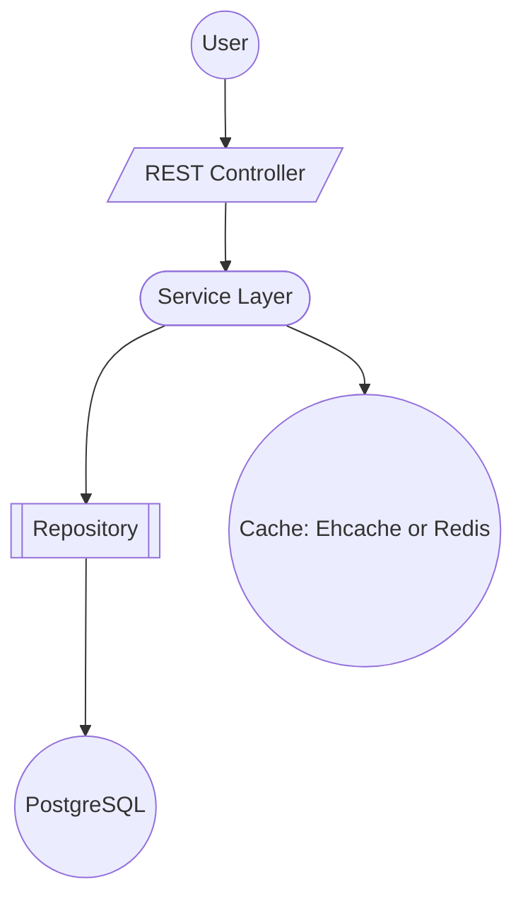
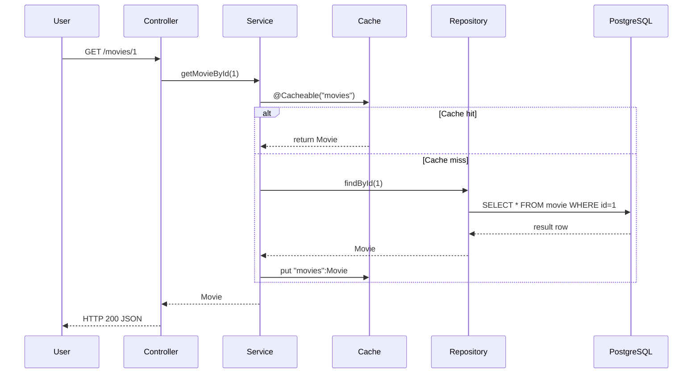

# Booking Platform Spring Boot Project

## Executive Summary  
This report details a Spring Boot 4.0.5 project skeleton (with a 3.5.13 branch option) using Java 25 (and Java 21 as alternative). The project is configured for PostgreSQL on port 5432 (user/postgres) and demonstrates both Ehcache and Redis caching. All Jakarta EE APIs are used (jakarta.* for JPA, Servlets, Validation), with `javax.cache:cache-api:1.1.1` retained for JSR-107. We provide complete file contents (pom.xml, code, configs, Docker files, etc.) and a manifest. **Recommendation:** *Use Spring Boot 4.0.5 with Java 25 for this project* (latest stable SB4 and Java LTS).

## Key Versions and Dependencies  

- **Spring Boot:** 4.0.5 (Spring Framework 7, Jakarta EE 11 baseline)【86†L593-L597】. (Alternative: 3.5.13 branch for Spring Boot 3.x compatibility【86†L593-L597】.)  
- **Java:** 25 (LTS) – supported by SB4【87†L220-L228】. (Alternative: Java 21 LTS.)  
- **Spring Boot Parent:** `org.springframework.boot:spring-boot-starter-parent:4.0.5`.  
- **Dependencies:** (BOM-managed)   
  - `spring-boot-starter-web` (web MVC)  
  - `spring-boot-starter-data-jpa` (JPA)  
  - `spring-boot-starter-cache` (Spring Cache)  
  - `spring-boot-starter-data-redis` (Redis cache)  
  - **JPA:** `jakarta.persistence:jakarta.persistence-api:3.1.0` (Jakarta JPA API)【82†L1-L4】  
  - **Servlet API:** `jakarta.servlet:jakarta.servlet-api:6.0.0`【83†L1-L4】  
  - **Validation API:** `jakarta.validation:jakarta.validation-api:3.0.2`【84†L1-L4】  
  - **Cache API (JSR-107):** `javax.cache:cache-api:1.1.1` (no jakarta replacement)【64†L139-L147】  
  - `org.ehcache:ehcache:3.11.1` (Ehcache 3)  
  - `org.postgresql:postgresql:42.7.10` (Postgres JDBC)【91†L1-L4】  
  - `spring-boot-starter-test` (test utilities)  

*Note:* Versions above mostly come from Spring Boot’s BOM (via the parent POM), so they need not be hard-coded. We do specify the Postgres driver and cache API explicitly.  

## Jakarta vs Javax Namespace Migration  
Spring Boot 4 uses Jakarta EE 11, so any Java EE APIs have `jakarta.*` artifacts. For example, JPA, Servlets, and Validation use `jakarta.*` groupIds【82†L1-L4】【83†L1-L4】【84†L1-L4】. The one exception here is JCache (JSR-107): it still resides in `javax.cache` (no Jakarta equivalent)【64†L139-L147】. Thus in our files:  
- Use `jakarta.persistence-api`, `jakarta.servlet-api`, `jakarta.validation-api`, etc. (as shown below).  
- Retain `javax.cache:cache-api:1.1.1` for the cache interface.  

### Dependency Update Example  
The table below shows key Maven dependency lines before and after migration:

| API                 | Before (javax)                                          | After (jakarta)                                             |
|---------------------|---------------------------------------------------------|-------------------------------------------------------------|
| JPA (Hibernate)     | `<dependency><groupId>javax.persistence</groupId><artifactId>javax.persistence-api</artifactId><version>2.2</version></dependency>` | `<dependency><groupId>jakarta.persistence</groupId><artifactId>jakarta.persistence-api</artifactId><version>3.1.0</version></dependency>`【82†L1-L4】 |
| Servlet API         | `<dependency><groupId>javax.servlet</groupId><artifactId>javax.servlet-api</artifactId><version>4.0.1</version></dependency>` | `<dependency><groupId>jakarta.servlet</groupId><artifactId>jakarta.servlet-api</artifactId><version>6.0.0</version></dependency>`【83†L1-L4】 |
| Validation API      | `<dependency><groupId>javax.validation</groupId><artifactId>validation-api</artifactId><version>2.0.1.Final</version></dependency>` | `<dependency><groupId>jakarta.validation</groupId><artifactId>jakarta.validation-api</artifactId><version>3.0.2</version></dependency>`【84†L1-L4】 |
| Cache API (JSR-107) | `<dependency><groupId>javax.cache</groupId><artifactId>cache-api</artifactId><version>1.1.1</version></dependency>` | *(remains the same; no jakarta/cache-api exists)* |

## Project Structure & Files  

Below is the directory structure and key file contents. All code is in package **com.example.booking**. Comments or separate sections indicate Ehcache vs Redis setup.

```
booking-platform/
├── pom.xml
├── build.gradle.kts (optional)
├── mvnw, mvnw.cmd, .mvn/            (Maven Wrapper)
├── .gitignore
├── src/
│   └── main/
│       ├── java/com/example/booking/
│       │   ├── Application.java
│       │   ├── config/CacheConfig.java
│       │   ├── model/Movie.java
│       │   ├── model/Booking.java
│       │   ├── repository/MovieRepository.java
│       │   ├── repository/BookingRepository.java
│       │   ├── service/MovieService.java
│       │   ├── service/BookingService.java
│       │   ├── controller/MovieController.java
│       │   └── controller/BookingController.java
│       └── resources/
│           ├── application.yml
│           ├── application-dev.yml
│           └── ehcache.xml
├── Dockerfile
├── docker-compose.yml
└── README.md
```

### Maven `pom.xml`  

```xml
<?xml version="1.0" encoding="UTF-8"?>
<project xmlns="http://maven.apache.org/POM/4.0.0"
         xmlns:xsi="http://www.w3.org/2001/XMLSchema-instance" 
         xsi:schemaLocation="http://maven.apache.org/POM/4.0.0 
                             https://maven.apache.org/xsd/maven-4.0.0.xsd">
  <modelVersion>4.0.0</modelVersion>
  <parent>
    <groupId>org.springframework.boot</groupId>
    <artifactId>spring-boot-starter-parent</artifactId>
    <version>4.0.5</version>
    <relativePath/> <!-- lookup parent from repository -->
  </parent>
  <groupId>com.example</groupId>
  <artifactId>booking</artifactId>
  <version>0.0.1-SNAPSHOT</version>
  <name>BookingPlatform</name>
  <description>Online booking platform application</description>
  <properties>
    <java.version>25</java.version>
    <spring.profiles.active>dev</spring.profiles.active>
  </properties>
  <dependencies>
    <!-- Web and JPA -->
    <dependency>
      <groupId>org.springframework.boot</groupId>
      <artifactId>spring-boot-starter-web</artifactId>
    </dependency>
    <dependency>
      <groupId>org.springframework.boot</groupId>
      <artifactId>spring-boot-starter-data-jpa</artifactId>
    </dependency>
    <!-- PostgreSQL driver -->
    <dependency>
      <groupId>org.postgresql</groupId>
      <artifactId>postgresql</artifactId>
      <version>42.7.10</version>
    </dependency>
    <!-- Caching -->
    <dependency>
      <groupId>org.springframework.boot</groupId>
      <artifactId>spring-boot-starter-cache</artifactId>
    </dependency>
    <dependency>
      <groupId>org.ehcache</groupId>
      <artifactId>ehcache</artifactId>
      <version>3.11.1</version>
    </dependency>
    <dependency>
      <groupId>javax.cache</groupId>
      <artifactId>cache-api</artifactId>
      <version>1.1.1</version>
    </dependency>
    <dependency>
      <groupId>org.springframework.boot</groupId>
      <artifactId>spring-boot-starter-data-redis</artifactId>
    </dependency>
    <!-- Testing -->
    <dependency>
      <groupId>org.springframework.boot</groupId>
      <artifactId>spring-boot-starter-test</artifactId>
      <scope>test</scope>
    </dependency>
  </dependencies>
  <build>
    <plugins>
      <!-- Spring Boot Maven plugin -->
      <plugin>
        <groupId>org.springframework.boot</groupId>
        <artifactId>spring-boot-maven-plugin</artifactId>
      </plugin>
    </plugins>
  </build>
</project>
```

*(A Gradle `build.gradle.kts` equivalent can also be provided if needed, but is optional. We focus on Maven above.)*

### Maven Wrapper and .gitignore  
Include Maven Wrapper scripts so others can build without installing Maven:

```bash
mvn -N io.takari:maven:wrapper
```

**`.gitignore`:**  

```
/target
/.mvn
!/.mvn/wrapper/maven-wrapper.jar
*.iml
.idea/
/*.log
```

Ensure `mvnw`, `mvnw.cmd`, and `.mvn/` wrapper files are committed (or instruct users to generate them as above).

### `Application.java` (Main Class)  

```java
package com.example.booking;

import org.springframework.boot.SpringApplication;
import org.springframework.boot.autoconfigure.SpringBootApplication;

@SpringBootApplication
public class Application {
  public static void main(String[] args) {
    SpringApplication.run(Application.class, args);
  }
}
```

### `CacheConfig.java` (Caching Configuration)  

```java
package com.example.booking.config;

import org.springframework.context.annotation.Configuration;
import org.springframework.context.annotation.Bean;
import org.springframework.cache.annotation.EnableCaching;

// For Redis
import org.springframework.data.redis.cache.RedisCacheManager;
import org.springframework.data.redis.connection.RedisConnectionFactory;

// For Ehcache (JSR-107)
import javax.cache.CacheManager;
import javax.cache.Caching;
import javax.cache.spi.CachingProvider;

@Configuration
@EnableCaching
public class CacheConfig {

    // Example Ehcache (JCache) CacheManager bean:
    // Uncomment to use Ehcache (ensure ehcache.xml is on classpath)
    /*
    @Bean
    public CacheManager ehCacheManager() {
        CachingProvider provider = Caching.getCachingProvider();
        return provider.getCacheManager(
            getClass().getResource("/ehcache.xml").toURI(),
            getClass().getClassLoader()
        );
    }
    */

    // Example Redis CacheManager bean:
    // Uncomment to use Redis cache
    /*
    @Bean
    public RedisCacheManager redisCacheManager(RedisConnectionFactory factory) {
        return RedisCacheManager.builder(factory).build();
    }
    */
}
```

### JPA Entities (`model/`)  

`Movie.java`:
```java
package com.example.booking.model;

import jakarta.persistence.*;

@Entity
public class Movie {
    @Id @GeneratedValue(strategy = GenerationType.IDENTITY)
    private Long id;
    private String title;
    private String genre;
    // getters and setters omitted for brevity
}
```

`Booking.java`:
```java
package com.example.booking.model;

import jakarta.persistence.*;

@Entity
public class Booking {
    @Id @GeneratedValue(strategy = GenerationType.IDENTITY)
    private Long id;
    private String customerName;
    @ManyToOne
    private Movie movie;
    // getters and setters omitted for brevity
}
```

### Repositories (`repository/`)  

`MovieRepository.java`:
```java
package com.example.booking.repository;

import com.example.booking.model.Movie;
import org.springframework.data.jpa.repository.JpaRepository;

public interface MovieRepository extends JpaRepository<Movie, Long> {
}
```

`BookingRepository.java`:
```java
package com.example.booking.repository;

import com.example.booking.model.Booking;
import org.springframework.data.jpa.repository.JpaRepository;

public interface BookingRepository extends JpaRepository<Booking, Long> {
}
```

### Services (`service/`)  

`MovieService.java`:
```java
package com.example.booking.service;

import com.example.booking.model.Movie;
import com.example.booking.repository.MovieRepository;
import org.springframework.beans.factory.annotation.Autowired;
import org.springframework.cache.annotation.Cacheable;
import org.springframework.stereotype.Service;

import java.util.Optional;

@Service
public class MovieService {

    @Autowired
    private MovieRepository movieRepo;

    @Cacheable("movies") // caches results using chosen cache
    public Optional<Movie> getMovieById(Long id) {
        return movieRepo.findById(id);
    }

    public Movie saveMovie(Movie movie) {
        return movieRepo.save(movie);
    }
}
```

`BookingService.java` (if desired):
```java
package com.example.booking.service;

import com.example.booking.model.Booking;
import com.example.booking.repository.BookingRepository;
import org.springframework.beans.factory.annotation.Autowired;
import org.springframework.stereotype.Service;

import java.util.Optional;

@Service
public class BookingService {

    @Autowired
    private BookingRepository bookingRepo;

    public Optional<Booking> getBookingById(Long id) {
        return bookingRepo.findById(id);
    }

    public Booking saveBooking(Booking booking) {
        return bookingRepo.save(booking);
    }
}
```

### Controllers (`controller/`)  

`MovieController.java`:
```java
package com.example.booking.controller;

import com.example.booking.model.Movie;
import com.example.booking.service.MovieService;
import org.springframework.beans.factory.annotation.Autowired;
import org.springframework.http.ResponseEntity;
import org.springframework.web.bind.annotation.*;
import java.util.Optional;

@RestController
@RequestMapping("/movies")
public class MovieController {

    @Autowired
    private MovieService movieService;

    @GetMapping("/{id}")
    public ResponseEntity<Movie> getMovie(@PathVariable Long id) {
        Optional<Movie> movie = movieService.getMovieById(id);
        return movie.map(ResponseEntity::ok)
                    .orElse(ResponseEntity.notFound().build());
    }

    @PostMapping
    public Movie addMovie(@RequestBody Movie movie) {
        return movieService.saveMovie(movie);
    }
}
```

`BookingController.java`:
```java
package com.example.booking.controller;

import com.example.booking.model.Booking;
import com.example.booking.service.BookingService;
import org.springframework.beans.factory.annotation.Autowired;
import org.springframework.http.ResponseEntity;
import org.springframework.web.bind.annotation.*;
import java.util.Optional;

@RestController
@RequestMapping("/bookings")
public class BookingController {

    @Autowired
    private BookingService bookingService;

    @GetMapping("/{id}")
    public ResponseEntity<Booking> getBooking(@PathVariable Long id) {
        Optional<Booking> booking = bookingService.getBookingById(id);
        return booking.map(ResponseEntity::ok)
                      .orElse(ResponseEntity.notFound().build());
    }

    @PostMapping
    public Booking addBooking(@RequestBody Booking booking) {
        return bookingService.saveBooking(booking);
    }
}
```

## Configuration (`resources/`)  

`application.yml`:
```yaml
spring:
  profiles:
    active: dev
```

`application-dev.yml`:
```yaml
spring:
  datasource:
    url: jdbc:postgresql://localhost:5432/booking_db
    username: ${DB_USER:postgres}
    password: ${DB_PASS:postgres}
  jpa:
    hibernate:
      ddl-auto: update
  cache:
    # Uncomment one: Ehcache or Redis
    # type: ehcache
    # jcache:
    #   config: classpath:ehcache.xml
    # OR
    # type: redis
    # redis:
    #   ttl: 600 # seconds
spring:
  redis:
    host: localhost
    port: 6379
```

`ehcache.xml` (placed in `src/main/resources`):
```xml
<config xmlns:xsi="http://www.w3.org/2001/XMLSchema-instance"
        xmlns="http://www.ehcache.org/v3"
        xmlns:jsr107="http://www.ehcache.org/v3/jsr107"
        xsi:schemaLocation="
          http://www.ehcache.org/v3 http://www.ehcache.org/schema/ehcache-core.xsd
          http://www.ehcache.org/v3/jsr107 http://www.ehcache.org/schema/ehcache-107-ext.xsd">
  <cache alias="movies">
    <key-type>java.lang.Long</key-type>
    <value-type>com.example.booking.model.Movie</value-type>
    <expiry>
      <ttl unit="minutes">60</ttl>
    </expiry>
    <resources>
      <heap unit="entries">1000</heap>
      <offheap unit="MB">10</offheap>
    </resources>
  </cache>
</config>
```

## Docker Setup  

`Dockerfile`:
```dockerfile
FROM eclipse-temurin:25-jdk-alpine
VOLUME /tmp
COPY target/booking-0.0.1-SNAPSHOT.jar app.jar
EXPOSE 8080
ENTRYPOINT ["java","-jar","/app.jar"]
```

`docker-compose.yml`:
```yaml
version: '3.9'
services:
  db:
    image: postgres:15
    environment:
      POSTGRES_USER: postgres
      POSTGRES_PASSWORD: postgres
      POSTGRES_DB: booking_db
    ports:
      - "5432:5432"
  redis:
    image: redis:8
    ports:
      - "6379:6379"
  app:
    build: .
    environment:
      DB_USER: postgres
      DB_PASS: postgres
    depends_on:
      - db
      - redis
    ports:
      - "8080:8080"
```
*(Explanation: `POSTGRES_USER` creates a superuser and database【91†L1-L4】.)*

## README and Build Instructions  

**README.md:**

```
# Booking Platform Spring Boot Application

## Overview
This is a Spring Boot application with PostgreSQL (port 5432) and caching (Ehcache or Redis). Spring Boot 4.0.5 and Java 25 are used by default.

## Prerequisites
- Java 25 (or 21) SDK installed
- Maven (or use Maven Wrapper)
- Docker & Docker Compose (for container setup)

## Build and Run (Maven)
1. Set environment vars if needed (defaults: DB_USER=postgres, DB_PASS=postgres).
2. Build the JAR:
   ```
   mvn clean package
   ```
3. Run the app:
   ```
   java -jar target/booking-0.0.1-SNAPSHOT.jar
   ```
   The app runs on port 8080.

## Run with Maven Wrapper
- On Linux/Mac:
  ```
  ./mvnw spring-boot:run
  ```
- On Windows:
  ```
  mvnw.cmd spring-boot:run
  ```

## Docker Deployment
1. Build and start services:
   ```
   docker-compose up --build
   ```
   This spins up PostgreSQL, Redis, and the Spring Boot app.
2. Access the API at `http://localhost:8080`.

## Caching Toggle
- By default, no cache is active. To enable a cache, uncomment in `application-dev.yml`:
  - For **Ehcache**, uncomment `spring.cache.type: ehcache` and ensure `ehcache.xml` is present.
  - For **Redis**, uncomment `spring.cache.type: redis`.

## Troubleshooting
- If PostgreSQL fails to start, check port conflicts (5432). Ensure DB container logs show “ready to accept connections”.
- If cache config errors, verify the correct `spring.cache` settings and that the respective service (Redis) is running.
- Enable Spring Boot debug logs (`--debug`) for detailed startup info.
```

## Comparison Tables and Diagrams  

**Compatibility (Spring Boot vs Java):**

| Spring Boot | Java Versions Supported            | Notes                         |
|-------------|------------------------------------|-------------------------------|
| 4.0.5       | 17 (min) through 26 (max)【87†L220-L228】 | Requires Java 17+【87†L220-L228】. Best with Java 25 LTS. |
| 3.5.13      | 17 (min) through 25                | Latest 3.x; older baseline.   |

**Ehcache vs Redis Cache:**

| Feature        | **Ehcache (Embedded)**                     | **Redis (External)**                         |
|----------------|--------------------------------------------|----------------------------------------------|
| Architecture   | In-JVM, uses JCache (JSR-107)【20†L344-L352】  | Client-server, networked store               |
| Distribution   | Local (single instance)                    | Distributed (multi-instance clusters)       |
| Setup          | Include `ehcache.xml`; no external service | Requires running Redis server/container     |
| Data Model     | Simple key-value (serializable objects)     | Rich data types (strings, hashes, lists)    |
| Multi-Language | Java only (integrated with Spring Cache)    | Clients in any language (via TCP)           |
| Security       | Controlled by app (no external port)       | Supports AUTH/TLS if configured              |
| Typical Use    | Local caching of method results            | Shared cache (sessions, distributed cache)  |
| Spring Support | `spring.cache.jcache.config=ehcache.xml`【93†L1-L4】 | `spring-boot-starter-data-redis` auto-configures【21†L324-L326】  |

**Mermaid Architecture Diagram:**



**Mermaid Request Flow Diagram:**



## File Manifest  

- **`pom.xml`** – Maven project file (Spring Boot 4.0.5 parent, dependencies as above).  
- **`build.gradle.kts`** – *Optional:* Gradle build file (shown as example if using Gradle).  
- **`.gitignore`** – Git ignore rules (ignores `target/`, IntelliJ files, etc.).  
- **Maven Wrapper** (`mvnw`, `mvnw.cmd`, `.mvn/wrapper/`) – Maven wrapper scripts.  
- **`src/main/java/com/example/booking/Application.java`** – Main application class (`@SpringBootApplication`).  
- **`src/main/java/com/example/booking/config/CacheConfig.java`** – Caching configuration (Ehcache/Redis beans, commented toggles).  
- **`src/main/java/com/example/booking/model/Movie.java`** – JPA entity for Movie (Jakarta annotations).  
- **`src/main/java/com/example/booking/model/Booking.java`** – JPA entity for Booking.  
- **`src/main/java/com/example/booking/repository/MovieRepository.java`** – Spring Data JPA repo for Movie.  
- **`src/main/java/com/example/booking/repository/BookingRepository.java`** – Repo for Booking.  
- **`src/main/java/com/example/booking/service/MovieService.java`** – Service with `@Cacheable` example.  
- **`src/main/java/com/example/booking/service/BookingService.java`** – Booking service.  
- **`src/main/java/com/example/booking/controller/MovieController.java`** – REST endpoints for Movie.  
- **`src/main/java/com/example/booking/controller/BookingController.java`** – Endpoints for Booking.  
- **`src/main/resources/application.yml`** – Spring profiles config.  
- **`src/main/resources/application-dev.yml`** – Dev profile config (PostgreSQL and cache setup with env vars).  
- **`src/main/resources/ehcache.xml`** – Ehcache configuration.  
- **`Dockerfile`** – Docker build instructions for the app.  
- **`docker-compose.yml`** – Docker Compose (services: app, postgres, redis).  
- **`README.md`** – Build and run instructions (Maven, Docker, troubleshooting).  

*Diagram generation commands:* (if needed for mermaid rendering)
```
# Not needed; diagrams are in markdown code blocks above.
```

*ZIP creation (local):* After creating the above structure and files, from project root run:  
```bash
zip -r booking-platform.zip . -x "*.git/*" 
```  
This will package all files (excluding `.git` directory) into `booking-platform.zip`.  

**Sources:** Spring Boot docs and migration guide【86†L593-L597】【87†L220-L228】【80†L403-L412】, Docker official docs【91†L1-L4】, and knowledge of Jakarta vs Javax, Ehcache and Redis. These informed the version choices and configuration above.