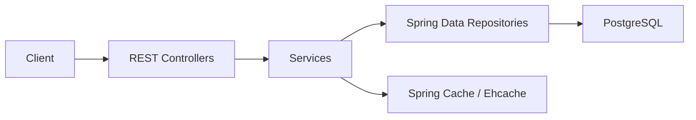
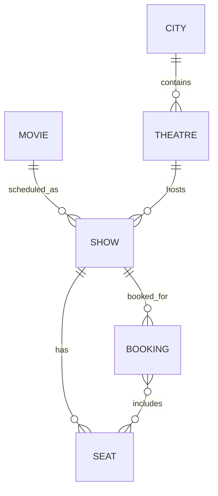
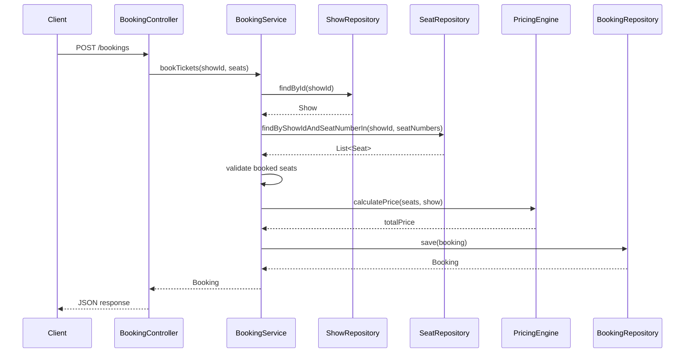

# Booking Platform Design

## Purpose
This document describes the current technical design of the Booking Platform Spring Boot application as implemented in the repository.

The system is designed to support a basic movie ticket booking workflow:

- manage movies
- browse shows by city and date
- reserve seats for a show
- calculate booking price using simple pricing rules
- cache read-heavy lookups

## System Overview
The application follows a standard layered Spring architecture:

- controller layer for HTTP APIs
- service layer for business logic
- repository layer for persistence
- JPA entity model for relational mapping
- PostgreSQL as the primary database
- Ehcache via JCache for method-level caching

## Mermaid Architecture Diagram
High-level architecture:

## Architectural Layers

### 1. Controller Layer
The controller layer exposes REST endpoints and delegates business logic to services.

Current controllers:

- `MovieController`
- `BrowseController`
- `BookingController`

Responsibilities:

- map HTTP requests to Java methods
- deserialize request payloads
- return entities or HTTP responses
- apply cache annotations on selected read endpoints

### 2. Service Layer
The service layer contains the booking, browsing, movie, and pricing logic.

Current services:

- `MovieService`
- `BrowseService`
- `BookingService`
- `PricingEngine`

Responsibilities:

- orchestrate repository calls
- validate seat availability during booking
- calculate booking totals
- isolate business rules from controller code

### 3. Repository Layer
The repository layer uses Spring Data JPA for persistence.

Current repositories:

- `MovieRepository`
- `ShowRepository`
- `SeatRepository`
- `BookingRepository`

Responsibilities:

- CRUD access for entities
- derived-query support for browse and booking use cases

## Core Domain Model

### City
Represents a city in which theatres operate.

Key fields:

- `id`
- `name`

### Theatre
Represents a theatre in a city.

Key fields:

- `id`
- `name`
- `city`

### Movie
Represents a movie available for booking.

Key fields:

- `id`
- `title`
- `genre`

### Show
Represents a scheduled screening of a movie in a theatre.

Key fields:

- `id`
- `movie`
- `theatre`
- `showDate`
- `showTime`
- `price`

### Seat
Represents a seat for a given show.

Key fields:

- `id`
- `seatNumber`
- `show`
- `isBooked`

Constraint:

- unique seat number per show

### Booking
Represents a completed booking.

Key fields:

- `id`
- `show`
- `totalPrice`
- `seats`
- `createdAt`

## Entity Relationships
The current relationship model is:

Relationship notes:

- one city contains many theatres
- one theatre belongs to one city
- one movie can have many shows
- one show belongs to one movie
- one show belongs to one theatre
- one show has many seats
- one booking belongs to one show
- one booking can contain many seats

## API Design

### Movie APIs
`/movies`

Supported operations:

- `POST /movies` to create a movie
- `GET /movies/{id}` to fetch a movie by ID

Notes:

- `GET /movies/{id}` is cache-enabled
- movie creation directly persists the request body as a `Movie` entity

### Browse APIs
`/browse`

Supported operations:

- `GET /browse/shows?movieId={id}&city={name}&date={yyyy-MM-dd}`

Notes:

- browse calls filter by movie, city, and show date
- browse lookup is cache-enabled

### Booking APIs
`/bookings`

Supported operations in the code:

- `GET /bookings/{id}` to fetch a booking
- `POST /bookings` with `BookingRequest`
- `POST /bookings` with `Booking`

Design concern:

- there are currently two `POST /bookings` methods mapped to the same route, which will create an ambiguous mapping problem in Spring MVC

Recommended direction:

- keep one public booking endpoint for customer booking requests
- move raw entity persistence to a distinct internal/admin route if still needed

## Booking Flow
The booking flow is implemented in `BookingService#bookTickets`.

Current sequence:

1. load the target `Show`
2. load seats for the given show and requested seat numbers
3. check whether any returned seat is already booked
4. mark seats as booked
5. calculate total price using `PricingEngine`
6. create and save `Booking`

Sequence diagram:

## Pricing Design
Pricing is handled by the dedicated `PricingEngine` component.

Current rules:

1. base price = seat count multiplied by show price
2. if 3 or more seats are selected, apply a 50% discount for one ticket
3. if the show runs after 12:00 and before 16:00, apply an additional 20% discount to the total

This design keeps price calculation isolated from controller and repository concerns.

## Persistence Design
The application uses Spring Data JPA and PostgreSQL.

Configuration highlights:

- datasource URL: `jdbc:postgresql://localhost:5432/booking_db`
- default username: `postgres`
- default password: `postgres`
- Hibernate DDL mode: `update`

Important note:

- both SQL scripts and JPA entities exist in the repository, but they are not fully aligned
- the entity model should currently be treated as the source of truth

## Caching Design
Caching is enabled with `@EnableCaching` in the main application class.

Configured cache mode:

- `spring.cache.type=jcache`
- cache config loaded from `ehcache.xml`

Current cache usage:

- `MovieService#getMovieById`
- `MovieController#getMovie`
- `BrowseController#getShows`
- `BookingController#getBooking`

Cache design note:

- only the `movies` cache is explicitly defined in `ehcache.xml`
- methods using bare `@Cacheable` without a cache name rely on default behavior and should be standardized

## Cache Technology Decision
The repository includes both Ehcache-oriented runtime configuration and a Redis container in Docker Compose. The active design choice, however, is Ehcache.

### Why Ehcache Was Chosen
Ehcache fits the current system design better because:

- the application is currently a single Spring Boot service rather than a distributed cluster
- cached data is mainly read-heavy reference data and lookup results
- in-process caching keeps latency low because there is no remote cache call
- the operational model stays simpler for development and testing
- the current codebase does not yet need shared cache state across multiple application nodes

Redis becomes more attractive when the system needs:

- a distributed shared cache across multiple instances
- centralized session or token storage
- cross-service cache sharing
- higher operational scale with dedicated cache infrastructure

### Ehcache vs Redis Comparison
| Decision Area | Ehcache | Redis |
|---|---|---|
| Runtime model | Embedded inside the JVM | External standalone service |
| Access latency | Very low, in-process | Low, but includes network round trip |
| Operational complexity | Lower | Higher |
| Infrastructure requirement | None beyond the app process | Dedicated server or container |
| Shared cache across app replicas | No | Yes |
| Failure isolation | Tied to app instance lifecycle | Independent from app instance |
| Fit for local development | Excellent | Good, but heavier |
| Fit for current project stage | Excellent | Not necessary yet |

### Design Conclusion
For the current booking platform, Ehcache is the more appropriate default because it matches the application's present deployment model and keeps the architecture simpler. Redis should be treated as an expansion path for future multi-instance or distributed deployments rather than the primary cache backend today.

## Deployment Design

### Local Development
The default active profile is `dev`, which points to a local PostgreSQL instance on port `5432`.

### Docker Compose
The repository includes a `docker-compose.yml` with:

- PostgreSQL 15
- Redis 8
- the Spring Boot app

Design note:

- Redis is provisioned in Docker Compose, but the active runtime configuration uses JCache/Ehcache rather than Redis caching

### Dockerfile
The app image is based on:

- `eclipse-temurin:21-jdk-alpine`

Current risk:

- the `Dockerfile` expects `target/booking-0.0.1-SNAPSHOT.jar`
- the built artifact in this project is `target/booking-platform-0.0.1-SNAPSHOT.jar`

## Design Strengths
- clear layered architecture
- compact domain model that matches a booking workflow
- pricing logic separated into its own component
- use of Spring Data derived queries keeps repository code minimal
- caching is already enabled for read-heavy paths

## Current Gaps and Risks

### API Design Risks
- duplicate `POST /bookings` mappings will conflict
- no validation annotations on request payloads
- exceptions are thrown as generic `RuntimeException` values

### Booking Integrity Risks
- seat lookup does not verify that all requested seat numbers were found
- no optimistic or pessimistic locking strategy is implemented for concurrent seat booking
- `createdAt` is required on `Booking` but is not set in `BookingService`

### Serialization Risks
- entities are returned directly from controllers, which can become fragile as relationships expand
- DTO boundaries are only partially implemented through `BookingRequest`

### Schema Drift Risks
- SQL schema files do not fully match the JPA entity mapping
- one root SQL file uses `movie_id` in `booking`, while the entity maps `show_id`

### Test Coverage Risks
- test coverage is minimal
- the default context load test is currently commented out

## Recommended Next Design Steps
Short-term improvements:

- resolve the duplicate booking POST route
- set `createdAt` automatically with `@PrePersist` or in service logic
- add request validation for booking and movie creation
- return structured error responses with a global exception handler
- align `Dockerfile` and SQL schema with the actual build and entity model

Medium-term improvements:

- introduce DTOs for API responses
- add booking concurrency controls
- define explicit cache names for all cached methods
- add integration tests for booking, browse, and pricing scenarios

Long-term improvements:

- add authentication and authorization
- support seat hold/timeout workflows
- add theatre and show management APIs
- consider distributed caching only if the application scales to multiple instances
